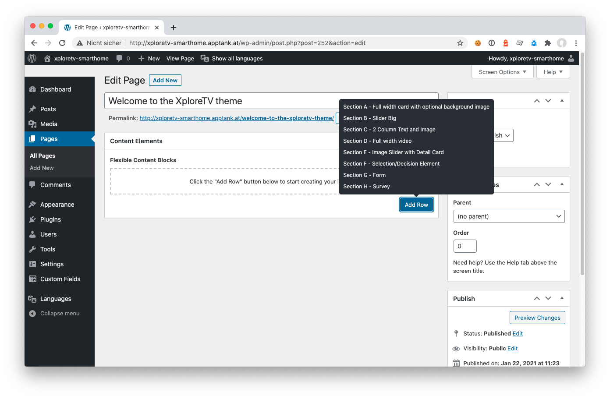
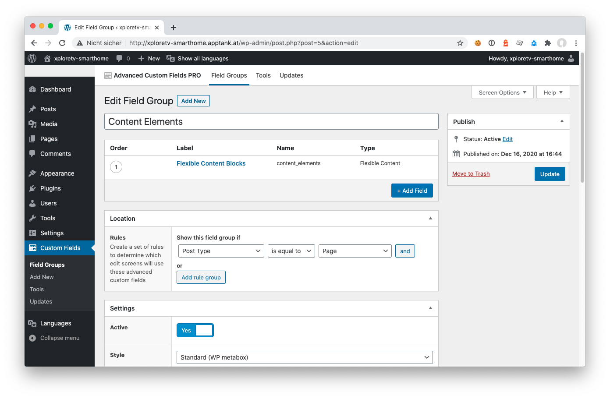
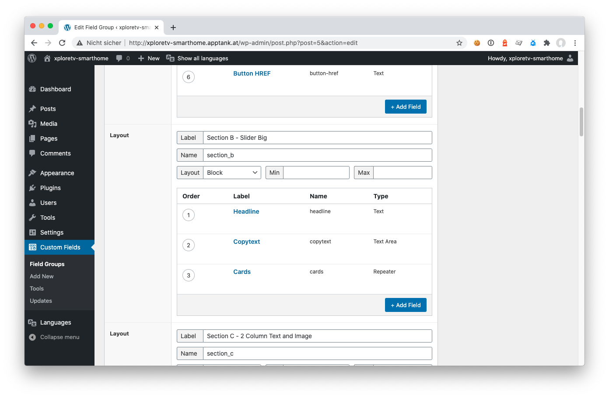

# xploretv - Technical documentation
<h2>Using the theme</h2>

The theme is made up of so called Flexible Content Blocks. Theses blocks can be freely combined on a page.

Please click the "Add Row" button at the right bottom of the block "Content Elements" to start creating your layout.
You can also drag and drop blocks to reorder them as you like.

Every block offers individual settings. The following blocks are currently integrated into the theme:

<h3>Full width card with optional background image</h3>
<h3>Selection/Decision element</h3>
<h3>Slider Big</h3>
<h3>Image Slider with Detail card</h3>
<h3>2 Column Text and Image</h3>
<h3>Full width video</h3>
<h3>Form</h3>
<h3>Survey</h3>

<h2>Extending the theme</h2>

In order to extend the theme you need to be familiar with WordPress theme development, CSS, Javascript and knowledge about ACF.
There are numerous ressources available that specifically cover each of there topics.
We only focus on the theme specific knowledge to get you started.
So if you need additional Flexible Content Blocks, you can extend the theme accordingly.

<h3>Creating a new template function</h3>

First of all you need to create a new template section in the file _functions/acf_content_elements.php.
Please do so by adding a new code block at the very end of the file.

    function content_element_section_NAME($all_data) {
        // Put your code here
    }

Please make sure to replace NAME with a unique identifier that we will later need in order to connect the template to ACF.
All data from ACF is coming in via the variable $all_data which is a nested array.
You can later replace your placeholder content with the values from the variable as soon as you have set up the ACF element accordingly.
Look at the other content_element_section_ functions in order to get inspired.
Take care that since we are on a set top box only a limited number of keys is supported and navigating a page needs to be possible with these keys only. The keys available on a regular remote control are as follows:

-Up
-Down
-Left
-Right
-Okay
-Back

<h3>Adding your filed group to ACF</h3>

Now head over to the WordPress backend and open up Custom Fields > Field Groups.
Select the field group Content Elements and open up Fexible Content Blocks. All the blocks mentioned above will show up now.

Feel free to add your own field by clicking the button "+ Add Field".

Make sure to give it a proper name starting with section_NAME and replace NAME with the name you previously used in as a function name for the template. This connection via the name will connect your ACF data with the template block.
Please consult the documentation of ACF to use the full capacity of the plugin.
Hit Update when you are done.

<h3>Connecting the dots</h3>

Now it's time to connect the ACF data within the variable $all_data as mentioned above.
The easiest way is to run var_dump($all_data) in order to see the data structure coming from ACF.

<h3>Adding the new block to your page</h3>

Open up a page and click on "Add Row" in order to select your new block element.
Put in the data as required and preview or publish to see the new block element in action.
